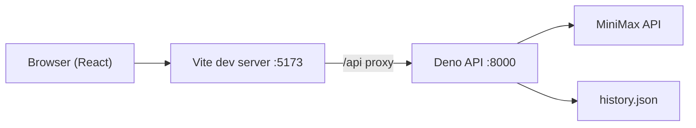

# Technical context

Architecture reference for the Sound Generator monorepo.

## Architecture



In production, serve the built `frontend/dist` static assets behind a reverse proxy that also forwards `/api` to the Deno backend.

## Workflows

### Song generation (`/`)

1. User selects model (`music-2.6` or `music-2.6-free`), style prompt, lyrics (or instrumental mode), optional lyrics optimizer.
2. `POST /api/generate` with JSON `GenerateRequest`.
3. Backend calls MiniMax music generation, then optional metadata generation for title/style tags.
4. History entry saved; frontend navigates to `/history/:entryId`.

**Validation highlights:**
- Instrumental: style prompt required, max 2000 chars.
- With lyrics (no optimizer): lyrics required, max 3500 chars.
- Style prompt max 2000 chars when provided.

### Cover generation (`/cover`)

1. User provides reference audio (file upload or URL) and cover model.
2. `POST /api/cover/preprocess` — extracts `coverFeatureId`, formatted lyrics, structure.
3. User edits prompt/lyrics, then `POST /api/cover/generate`.
4. Backend may upload audio to MiniMax file API, then calls cover generation.

Supports `multipart/form-data` (field `audio`) or JSON (`audioUrl`).

### Text-to-speech (`/tts`)

1. User provides voice sample (file or URL), text, and TTS model.
2. `POST /api/tts/generate` — clones voice and synthesizes speech.
3. Entry stores `voiceId` when available.

## API endpoints

| Method | Path | Description |
|--------|------|-------------|
| `GET` | `/api/health` | Health check `{ ok: true }` |
| `GET` | `/api/history` | List entries (pinned first, then by date) |
| `GET` | `/api/history/:id` | Single entry |
| `PATCH` | `/api/history/:id` | Update `title` and/or `pinned` |
| `DELETE` | `/api/history/:id` | Remove entry |
| `POST` | `/api/generate` | Song generation (JSON) |
| `POST` | `/api/cover/preprocess` | Cover preprocess (JSON or multipart) |
| `POST` | `/api/cover/generate` | Cover generation (JSON or multipart) |
| `POST` | `/api/tts/generate` | TTS generation (JSON or multipart) |

All responses are JSON. CORS headers use `CORS_ORIGIN` env var.

## Core types

`HistoryEntry` is the central persisted record:

```typescript
interface HistoryEntry {
  id: string;
  createdAt: string;          // ISO timestamp
  model: MusicModel;
  prompt: string;
  lyrics?: string;
  isInstrumental: boolean;
  lyricsOptimizer: boolean;
  referenceAudioUrl?: string; // label for cover/TTS source
  audioUrl?: string;          // generated audio URL
  title?: string;
  styleTags?: string[];
  pinned?: boolean;
  status: "completed" | "failed";
  errorCode?: string;
  errorParams?: Record<string, string | number>;
  traceId?: string;
  durationMs?: number;
  voiceId?: string;           // TTS only
}
```

Model sets (backend `types.ts`):

- `SONG_MODELS`: `music-2.6`, `music-2.6-free`
- `COVER_MODELS`: `music-cover`, `music-cover-free`
- `TTS_MODELS`: `speech-2.8-hd`, `speech-2.8-turbo`

## Error handling

### Backend

- `ApiError` class in `errors.ts` carries `code`, optional `params`, optional `traceId`.
- `mapMiniMaxErrorCode()` translates upstream MiniMax `base_resp.status_code` to internal codes (`RATE_LIMIT`, `INSUFFICIENT_BALANCE`, `CONTENT_FLAGGED`, etc.).
- Client validation → HTTP 400 with `{ errorCode, errorParams? }`.
- Generation failure after history write → HTTP 422 with `{ errorCode, errorParams?, entry }`.

### Frontend

- `api/client.ts` throws `ApiClientError` for non-generation failures.
- Song/cover/TTS generation returns `{ entry, error? }` on 422 without throwing.
- `lib/translateError.ts` maps `errorCode` → localized string via i18n keys under `errors.*`.

When adding a new error code, update: `backend/errors.ts`, `main.ts` `errorStatus()` if needed, `translateError.ts`, and both locale files.

## Frontend structure

```
frontend/src/
├── routes/           # TanStack file routes (/, /cover, /tts, /history/$entryId)
├── components/       # Page shells (GenerationPage, CoverPage, TtsPage) + forms/UI
├── api/client.ts     # All backend HTTP calls
├── context/          # ThemeContext, HistoryContext
├── lib/              # generation.ts, cover.ts, tts.ts, translateError.ts
├── locales/          # en/translation.json, ru/translation.json
├── i18n/             # i18next setup
└── types.ts          # Domain types (mirror of backend)
```

**State flow:** `HistoryProvider` loads history on mount. After generation, pages call `refreshHistory()` and navigate to the entry detail route. Duplicate-from-history passes router state (`duplicate` prefill).

## Backend structure

```
backend/
├── main.ts              # HTTP router, CORS, handlers
├── minimax.ts           # Song + cover MiniMax calls, song/cover validation
├── minimax-tts.ts       # TTS / voice clone
├── minimax-metadata.ts  # Title/style tag generation via MiniMax
├── cover-parse.ts       # Cover request parsing (JSON + multipart)
├── tts-parse.ts         # TTS request parsing
├── history.ts           # JSON file persistence
├── errors.ts            # ApiError types and MiniMax mapping
├── types.ts             # Shared domain + MiniMax response types
└── data/history.json    # Runtime data (gitignored)
```

## External services

All generation goes through MiniMax (`api.minimax.io`):

| Feature | Endpoint (MiniMax) |
|---------|-------------------|
| Music | `v1/music_generation` |
| Cover preprocess | `v1/music_cover_preprocess` |
| Cover generate | (via `minimax.ts` cover flow) |
| TTS / voice clone | (via `minimax-tts.ts`) |

Requires `MINIMAX_API_KEY` in repo-root `.env`. Backend tasks load it via `deno.json` `--env-file=../.env`.

## Dev proxy

`frontend/vite.config.ts` proxies `/api` → `http://localhost:8000`. Frontend code uses relative paths (`/api/...`) so the same client works in dev and behind a combined production proxy.

## i18n

- Languages: `en` (default), `ru`.
- Detector: `i18next-browser-languagedetector`.
- All user-facing strings in `locales/*/translation.json`.
- Error messages keyed as `errors.<ERROR_CODE>` with interpolation for `errorParams`.

## Tooling

| Package | Lint | Format | Build |
|---------|------|--------|-------|
| frontend | oxlint | oxfmt | Vite + `tsc -b` |
| backend | — | Deno fmt (manual) | `deno run main.ts` |

Root `package.json` orchestrates workspace scripts via pnpm filters.
